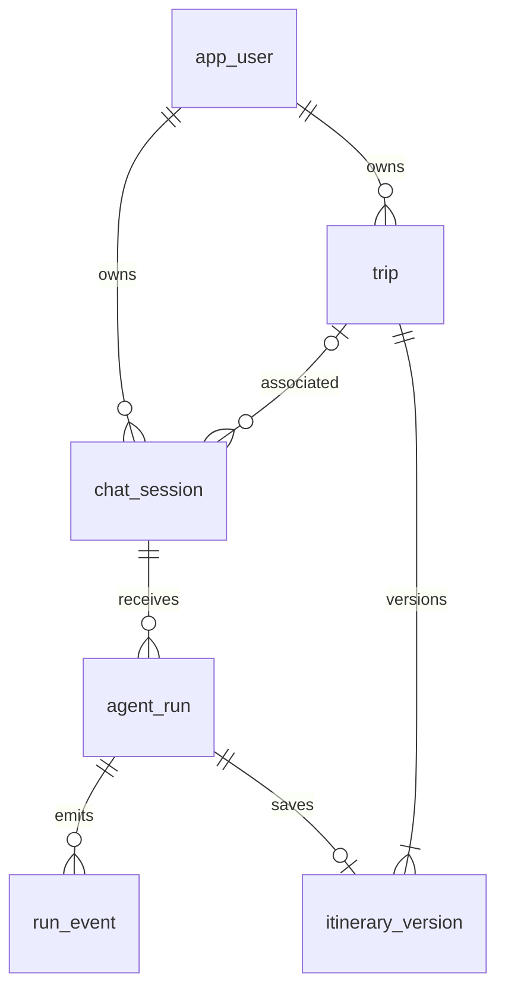

# 数据库模型 V1

六张 MySQL 表，适用于单实例 MVP。只持久化用户、会话、公开运行结果和已保存旅行；每天的安排、候选景点与路线采用 JSON 快照，不额外拆消息、景点、路线或日程表。

本次提供 ORM 与新库建表 SQL，**没有连接数据库、执行建表或迁移旧数据**。认证已改为数据库依赖骨架，尚未执行用户查询、写入或令牌业务；旅行保存与运行服务尚未实现。

阶段三已离线复核六表元数据、约束、关系与导出 DDL 一致性；没有执行真实事务。可运行 `uv run python -m scripts.verify_refactor` 重复只读验收。引擎启用 `hide_parameters=True`，减少驱动异常堆栈中的 SQL 参数泄露。

## 关系与存储约定



- 新会话的 trip_id 为空，首次成功保存才创建 trip 和 v1；同一用户多个会话可以关联同一旅行。
- 公开 UUID 存 `VARCHAR(36)`，写入前规范为带连字符的小写形式。Agent 内部 graph_run_id 保留其原始编号，不当作公开 run_id。
- BIGINT UNSIGNED 自增编号用于旅行、版本和运行内部排序；API 的 trip_id 输出字符串。版本号与事件序号为正整数。
- 时间使用 `DATETIME(6)` 保存 UTC。DDL 设置执行连接的 UTC 时区，后续应用连接池也必须设置 `time_zone='+00:00'`；当前连接池尚未完成此接入。API 投影对数据库读出的 UTC naive datetime 显式附加 UTC，DTO 不猜测无时区时间。
- 可空 JSON 使用 SQL NULL；必填列表无内容时写 `[]`。公开结果未知字段写 JSON null，不用 0 替代未知价格。
- 除保留原旅行版本外键删除行为外，新增外键采用默认 RESTRICT。暂不开放删除 API，不能通过删除运行破坏版本来源。
- 当前旅行指针必须引用同一旅行的版本；会话与关联旅行必须同一所有者。这两项跨表约束由后续事务服务检查，普通外键不能替代。

## 表与字段

### app_user：账号

| 字段 | 类型 | 说明 |
| --- | --- | --- |
| id | VARCHAR(36)，主键 | 用户 UUID |
| email | VARCHAR(254)，唯一 | strip + lowercase 后的邮箱 |
| password_hash / password_salt | BLOB(32) / BLOB(16) | PBKDF2-SHA256，240000 次，应用写入时保证 32/16 字节 |
| created_at | DATETIME(6) | UTC 创建时间 |

不得存明文密码。MySQL BLOB 的长度提示不等同于精确字节校验，认证服务负责长度及算法一致性。令牌不另建表；稳定签名密钥由后端配置提供。

### chat_session：多轮会话

| 字段 | 类型 / 可空 | 说明 |
| --- | --- | --- |
| session_id | VARCHAR(36)，主键 | 服务端会话 UUID |
| user_id | VARCHAR(36)，非空外键 | 所有者 |
| trip_id | BIGINT UNSIGNED，可空外键 | 首次成功保存后关联旅行 |
| trip_request_json | JSON，可空 | 最近已提交的完整 TripRequestDTO |
| pending_question | TEXT，可空 | 尚未被新消息回答的追问 |
| latest_run_id / active_run_id | VARCHAR(36)，可空 | 最近已发布终态 / 当前排队或执行的运行 |
| created_at / updated_at | DATETIME(6) | 创建和更新时间 |

运行指针不设反向外键，避免会话—运行循环。后续应用服务必须在锁定会话的短事务内维护指针，并检查指向本会话。索引 `(user_id, created_at, session_id)` 服务于列表分页。标题与当前版本号从需求及旅行派生，不单独存储。

### agent_run：一条消息的一次处理

| 字段 | 类型 / 可空 | 说明 |
| --- | --- | --- |
| id | BIGINT UNSIGNED，自增主键 | 内部提交排序，HTTP 不暴露 |
| run_id | VARCHAR(36)，唯一非空 | 公开运行 UUID |
| session_id | VARCHAR(36)，非空外键 | 所属会话 |
| client_request_id | VARCHAR(36)，非空 | 同一逻辑提交固定编号 |
| request_hash | VARCHAR(64)，非空 | 规范化请求 SHA-256 |
| message | TEXT，非空 | 1～4000 个 Unicode 字符，去首尾空白 |
| expected_version_no / base_version_no | INT UNSIGNED，可空 | 客户端期望版本 / 实际加载版本 |
| status / intent | VARCHAR(20)，状态非空、意图可空 | 与公开 RunStatus / RunIntent 一致 |
| response / pending_question | TEXT，可空 | 最终回答 / 本轮追问 |
| missing_fields_json | JSON，非空 | 缺失字段数组，初始 [] |
| result_json | JSON，非空 | 完整 RunResult，初始六个字段均为 null |
| error_json | JSON，可空 | PublicError，正常为空 |
| graph_run_id | VARCHAR(36)，可空 | 内部 Graph 编号，不向前端公开 |
| created_at | DATETIME(6)，非空 | 已受理时间 |
| started_at / finished_at | DATETIME(6)，可空 | 开始执行 / 发布终态时间 |

约束 `UNIQUE(session_id, client_request_id)` 防止重复受理；索引 `(session_id, id)` 支持历史分页，`(status, created_at)` 支持单实例重启核对。UUID、初始状态和 JSON 初值由服务层显式提供，数据库不随机生成或补业务默认值。

不额外建立消息表，也不把完整 AgentRunState、提示词或内部推理写入 result_json。用户输入和本轮回答足够恢复当前前端聊天历史。

### run_event：SSE 事件

| 字段 | 类型 | 说明 |
| --- | --- | --- |
| run_id + seq | VARCHAR(36) + INT UNSIGNED，联合主键 | run_id 外键；seq 从 1 开始 |
| event_type | VARCHAR(24) | run.started、progress、run.completed、run.needs_input、run.failed |
| data_json | JSON，非空 | RunStarted / Progress / RunView，仅保存 SSE data 内的业务 payload |
| occurred_at | DATETIME(6) | UTC 发生时间 |

从表字段组装 RunEvent 外壳，不重复把整个外壳存入 data_json。序号分配、状态写入、对应事件入库在同一事务中完成，再通知客户端。终态事件必须最多一次，后续服务用行锁及终态检查保证；联合主键本身不保证“最多一个终态”。事件和运行同生命周期，不提前删除重放记录。

### trip：旅行主表

保留 `id`、`request_json`、`current_version_id`、`created_at`、`updated_at`，新增非空 `user_id` 外键和索引。

`request_json` 是当前正式版本的需求镜像，不能被未保存的会话需求覆盖。当前版本指针保留已有外键，事务更新时同时更新该镜像。新旅行创建和 v1 保存处于同一事务，不对客户端发布空旅行。

### itinerary_version：不可变版本

保留 `id`、`trip_id`、`version_no`、`request_snapshot_json`、`itinerary_json`、`validation_json`、`total_cost`、`created_at`。

| 新字段 | 类型 | 说明 |
| --- | --- | --- |
| source_run_id | VARCHAR(36)，非空唯一外键 | 来源公开运行；一次运行最多一个版本 |
| routes_json | JSON，非空 | RouteDTO[]，无路线时 [] |
| content_hash | VARCHAR(64)，非空 | 四项业务快照的 SHA-256 |

保留 `UNIQUE(trip_id, version_no)`。`validation_json` 沿用原有可空数据库列，但**公开已保存版本要求非空且 passed=true**，写入服务须使用公开版本模型验证。`total_cost` 沿用可空 DECIMAL(12,2)，数值应与 itinerary_json.total_cost 一致。

## 摘要和事务边界

- `RunSubmission.request_hash()` 覆盖 `{message, expected_version_no}`，缺省版本规范为 null，不包含 client_request_id。相同幂等键且摘要不同返回冲突。
- `ItineraryVersion.content_hash()` 覆盖 `{trip_request, itinerary, routes, validation}`，不包含版本、运行或创建时间。按公开 DTO 的 JSON 形式计算；重试复用同一快照，包括原 checked_at。
- 两者使用字段排序、数组保序、无多余空白、非 ASCII 原样编码的 UTF-8 JSON，再计算 SHA-256 小写十六进制。禁止 NaN/Infinity。
- 摘要只是重复内容比对，不是鉴权或校验证明；跨会话修改仍需锁定旅行并比较期望版本。
- 后续受理事务：检查身份、锁定会话、先查幂等记录，再查活跃运行与版本，写运行并占用会话。不能把 LLM 或地图调用放进数据库事务。
- 后续保存事务：锁定旅行、核对版本、按 source_run_id 查重、写不可变版本、更新旅行指针与需求镜像。运行发布事务更新会话、运行和终态事件；保存已提交但尚未发布终态时，通过来源运行核对恢复。

## 生成与验收

```powershell
# 仅导出 SQL 文件，不建立数据库连接
uv run python -m scripts.export_schema_sql
uv run pytest tests/unit/models -q
```

SQL 由 ORM 按依赖顺序生成，最后添加旅行当前版本的反向外键。仅供新库使用，不包含 DROP、清库或旧数据迁移逻辑。目标采用 MySQL 8.0；实际建表、外键行为、并发锁和事务恢复仍须在后续数据库集成阶段验证。
